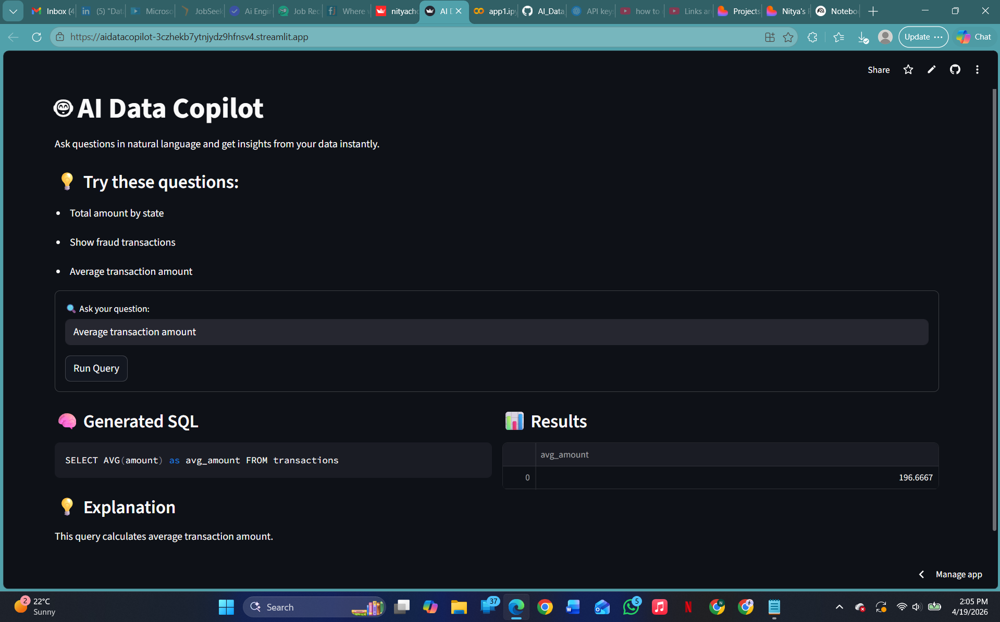

# 🤖 AI Data Copilot

## 🚀 Live Demo
👉 https://your-streamlit-app-link.streamlit.app

---

## 📌 Overview
AI Data Copilot is an interactive web application that enables users to query structured data using natural language.

Instead of writing SQL queries manually, users can simply type questions like:
- "Total amount by state"
- "Show fraud transactions"
- "Average transaction amount"

The system translates these inputs into SQL queries and returns results instantly with explanations and visualizations.

---

## ✨ Key Features
- 🔍 Natural Language → SQL Query Generation  
- 📊 Real-time Data Retrieval from Database  
- 💡 Automated Explanation of Results  
- 📈 Interactive Visualization (Bar Charts & Tables)  
- ⚡ Fast UI built with Streamlit  
- 🛠️ Backend powered by SQLAlchemy + SQLite  

---

## 🧠 System Architecture

User Input → Query Parser → SQL Generator → Database → Results + Visualization

---

## 🛠️ Tech Stack
- Python  
- Streamlit  
- Pandas  
- SQLAlchemy  
- SQLite  

---

## 📊 Example Queries
- Total amount by state  
- Show fraud transactions  
- Average transaction amount  

---

## 📸 Screenshots

### 🖥️ Application UI and 📊 Query Results

The main interface where users can input natural language queries.  
It provides example prompts and allows users to interact with the AI-powered data assistant in real time.

Displays the generated SQL query, corresponding results, and visualizations.  
Includes automatic explanations to help users understand the output.

---

## 🎯 Use Case
This project simulates real-world AI data copilots used by:
- Data Analysts  
- Business Teams  
- Product Managers  

It helps non-technical users explore data without writing SQL.

---

## 🚀 Getting Started (Run Locally)
1. Clone the repository

git clone https://github.com/your-username/ai-data-copilot.git
cd ai-data-copilot

2. Install dependencies

pip install -r requirements.txt

3. Run the application

streamlit run app.py

4. Open in browser

After running, open this in your browser:

http://localhost:8501

